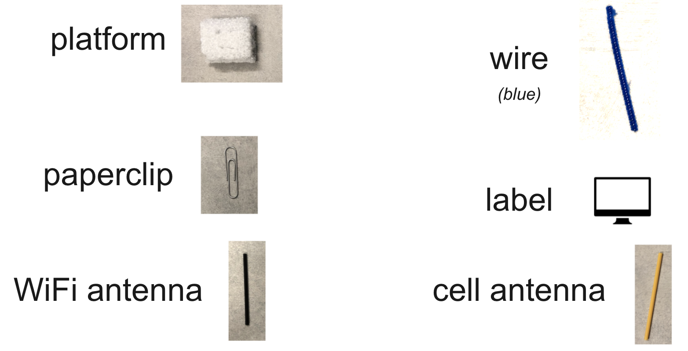
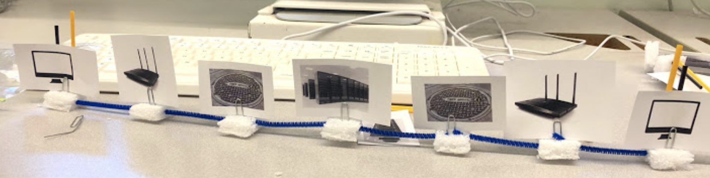

# Portfolio Lesson 1: Unplugged Networks

## Context
* **Intro to CS course, 9th grade**
* **Prior knowledge:** a brief introduction to the networks, with exposure to the following vocabulary:
  * IP address
  * DNS
  * ISP
  * URL
  * Router
  * Modem
* **Pedagogical technique(s):** this is an unplugged lesson where students will construct physical models to understand how computers and phones communicate with each other. Modeling networks hands-on will hopefully debunk the mystery that is "the internet." Students tend to think the internet is a mysterious black box that can simply be turned on or off.
* **Standard(s):** 9-12.NSD.4: Describe the components and design characteristics that allow data and information to be moved, stored and referenced over the Internet.

## Materials
* [Printouts of devices](https://docs.google.com/document/d/1HSFo8fCvMUkLClpQLmdZaltxXWcHpjiqxwMXU9aEdKM/preview)
* Styrofoam squares
* Paperclips
* Pipe cleaners, cut into 3-inch pieces
* Two different colored straws, cut into 3-inch pieces

## Warmup
Introduce students to the pieces:

Introduce students to the devices:

Show students examples of constructed components:

Show students the rules:

* **Example:** a computer can connect to a router either via a wired or wireless connection.
* **Note:** A cell phone can connect to a cell tower, but then the cell tower must be connected to the fiber / street level.

Students will then form groups of 3 and collect their materials (one student collect green, one collect red, one collect blue).

## Activity
Students build the following networks in any order:
1. computer-to-computer
2. computer-to-cell-phone
3. cell-phone-to-cell-phone

* Circulate and check-in with students to verify networks and look for misconceptions. When they finish one, they can deconstruct and move on to another.
* For students who complete networks 2 and/or 3, prompt them to change whether the phones are using their **wifi** antennas vs their **data** antennas.

## Summary

Prompt students to share what they learned. See what questions they have. Discuss specific networks that they make. Ask questions about them. For example, here are a few interesting ones they might make:

#### Example 1:

* **Can these computers communicate? If so, what kind of information could they share.**
  * Yes! This is called "intranet." They can share files with each other.
* **Are they using wired, wireless, or either?**
  * They can use either!
* **Can these computers visit websites? Why/why not?**
  * No. They are not connected to any data centers.

#### Example 2:

* **Is there anything wrong with this network?**
  * Computers don't have a cell antenna.
* **Could the computer be replaced by a phone and the network still work?**
  * Yes. A phone could also utilize its cell antenna and the router could be replaced by a cell tower.
