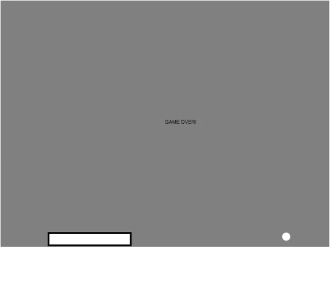
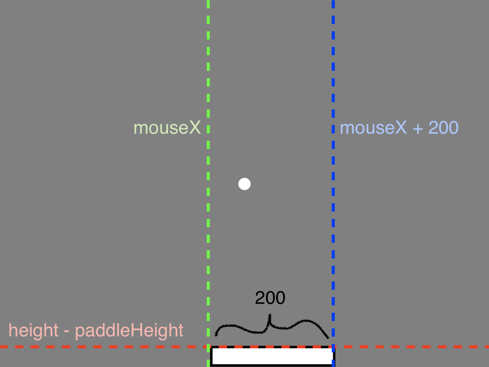

# Portfolio Lesson 2: P5js Pong



## Context
* **Programming course, 11th grade**
* **Prior knowledge:** Students will have learned Javascript programming basics such as variables, functions, and conditionals. They will also be familiar with P5js basics such as shapes, movement, and using the mouse position.
* **Pedagogical technique(s):** Live coding works best for this sort of activity. Students will likely view Pong as a very simple game. However, it is easier to program by first decomposing the game into smaller pieces. This lesson walks students through how to decompose the game, and how to write each piece. The heart of the program is within collision: using `if` statements (and most challenging: nested `if` statements) to determine when the ball bounces vs when the game is over. Doing a back-and-forth live coding will help students walk through a challenging program with the proper scaffolds.
* **Standard(s):** 9-12.CT.4: Implement a program using a
combination of student-defined and third-party functions to organize the computation.

## Materials
* All pong files listed in this directory.
  * Open [pong.html](pong.html) to test.
  * Final code is at [pong.js](pong.js).
* For easy coding, students can work in the [P5js editor](https://editor.p5js.org/).

## Warmup
* Have students play the [working game of Pong](pong-hidden.html) (the code is hidden).
* Ask students what sort of functions might be involved in the code. Decomposing as a class will make it easier to write the code. As needed, give hints towards these functions as the big picture pieces of our program:
  * `drawBall()`
  * `moveBall()`
  * `drawPaddle()`
  * `checkCollide()`

Note: we could write all of our code in the `draw()` loop, as _we_ are not manually calling these functions multiple times (the `draw()` automatically loops). However, writing our program as decomposed functions makes it much more readable, and easier to test.

## Activity
_Live coding, led by teacher. Students are given starter code, and type code along with teacher, making their own comments._

#### Starter code

Give students the starter code in [pong-skeleton.js](pong-skeleton.js), and walk through the bulk of the starter code and its comments.
```js
var ballX;              // x-location of the ball
var ballY;              // y-location of the ball
var ballSpeedX = 5;     // speed of the ball horizontally
var ballSpeedY = 5;     // speed of the ball vertically
var paddleHeight = 30;  // height of the paddle

function setup() {
  createCanvas(800, 600);   // canvas size
  noCursor();       // hides the mouse
  ballX = width/2;  // start the ball in the
  ballY = height/2; // middle of the canvas
}

function draw() {
  background(128); // resets the background
  drawBall();      // draws ball
  moveBall();      // ball moves in X and Y directions
  drawPaddle();    // draws paddle
  checkCollide();  // checks for collision with walls or paddle
}
```
Points of discussion before continuing:
* **If we wanted to, how could we make the ball start in the top-left corner?**
  * Set `ballX = 0` and `ballY = 0`
* **Which way does the ball begin moving? How do you know?**
  * Down because `ballSpeedX = -5` and right because `ballSpeedY = -5`
* **Any ideas why we are making `paddleHeight` its own variable?**
  * It will make more sense when we are checking for collision between the ball/paddle. If students don't have a guess, tell them to just remember that we saved this value in a variable for use later.
* **Does the order of our functions in `draw()` matter?**
  * Yes and no: `background()` needs to come first, but otherwise the order won't make much of a difference.

#### For the following functions, repeat this pattern:
* Type the code (not the comments), have students type as well. Explain what is going on.
* Have students write comments in their own words.
* Discuss the questions below.


##### `drawBall()`
```js
function drawBall() {
  noStroke(); // no outline needed
  ellipse(ballX, ballY, 20, 20); // draw ball at current location, constant diameter
}
```
* **Why do you think we chose a diameter of 20?**
  * Any smaller, it would be difficult to see.
  * Any larger, and this might cause problems with the collision we write later.
  * _Students probably won't predict problems with the collision, but remind them to tinker with this value after we write `checkCollide()`._


##### `moveBall()`
```js
function moveBall() {
  ballX = ballX + ballSpeedX; // updates ball location horizontally
  ballY = ballY + ballSpeedY; // updates ball location vertically

  // monitor speed/direction of ball
  console.log("ballSpeedX: " + ballSpeedX + ", ballSpeedY: " + ballSpeedY);
}
```

* **What would happen if we didn't include `ballY = ballY + ballSpeedY`**?
  * The ball would go left-to-right, but not up-and-down.
  * _Have students make a prediction, then try it!_
* **Why not just do `ballX += 5`?**
  * It would start off the same, but never be able to bounce.
  * _If students can't get this, ask the next question._
* **Why does the ball go off the screen? What might we need to `ballSpeedX` and/or `ballSpeedY` to prevent that?**
  * At some point, those values will need to be negative so that the position can go left/up.
* **What would happen if we also included the code `ballSpeedX++`?**
  * The ball would accelerate, not just move at a constant speed.
* **Why is it helpful to use `console.log()` in this case?**
  * We can keep an eye on the ball's speed to see that it _is_ still moving, it's just off the canvas (we could also add `ballX` and `ballY` if we wanted to).


##### `drawPaddle()`
```js
function drawPaddle() {
  stroke(0);       // color of paddle border
  strokeWeight(4); // border thickness of 4px

  // y-value is always at the bottom, minus height of paddle, minus border of paddle
  rect(mouseX, height-paddleHeight-4, 200, paddleHeight);
}
```
* **As a reminder, what is the significance of each value in `rect(num1,num2,num3,num4)?`**
  * The numbers are `rect(x,y,w,h)`
  * `(x,y)` represents the top-left corner of the rectangle.
* **Which part of the code allows the paddle to move?**
  * `mouseX` (follows the mouse horizontally: left-to-right)
* **What is the y-value at the bottom of the canvas?**
  * 600, or `height`
* **What would happen if we used `30` instead of `paddleHeight?`**
  * It wouldn't be as obvious why we're doing `height-30-4` or `height-34`.
  * If you wanted to change the numerical value height, you would have to change it in both places where `paddleHeight` is.


##### `checkCollide()`
```js
function checkCollide() {
  // left/right edge
  if (ballX < 0 || ballX > width) {
    ballSpeedX = ballSpeedX * -1; // switch X direction
  }

  // top edge
  if (ballY < 0) {
    ballSpeedY = ballSpeedY * -1; // switch Y direction
  }

  // paddle
  if (ballY > height-paddleHeight) { // past 'goal line'
    if (ballX > mouseX && ballX < mouseX + 200) { // within paddle
      ballSpeedY = ballSpeedY * -1; // switch Y direction
    } else { // end game
      text("GAME OVER!", width/2, height/2);
      noLoop();
    }
  }
}
```

Draw this diagram and use it to walk through the code & questions.



Start by typing:
```js
if (ballX < 0) {
  ballSpeedX = ballSpeedX * -1; // switch X direction
}
if (ballX > width) {
  ballSpeedX = ballSpeedX * -1; // switch X direction
}
```
* **How could we combine the above two statements into one `if()` condition?**
  * `if (ballX < 0 || ballX > width)`
* **Why do we need an `if` inside of an `if`?**
  * The first `if` is to check if we're past the goal line.
  * Once we know that is true, we need to check if we're within the paddle to determine whether to bounce or end the game.
* **What would happen if we changed `&&` to `||` in `ballX > mouseX && ballX < mouseX + 200`?**
  * The ball would _always_ bounce, as the condition is always true. Changing `&&` to `||` means just _one_ of the conditions needs to be true.
    * When the ball is left of the paddle, `ballX < mouseX + 200` is true.
    * When the ball is to the right of the paddle, `ballX > mouseX` is true.
    * When the ball is in the middle, they're both true.
  * Using `&&` ensures we're _both_ to the _right_ of the left edge of the paddle, _and_ to the _left_ of the right edge of the paddle.
  * _It helps to draw arrows: right arrow on the green line, left arrow on the blue line._


## Summary
Discuss the pros and cons of using the P5js library to make Pong. For example, P5js is useful for allowing us to quickly and easily draw and move shapes on the canvas. However, collision is not a built-in feature, so it requires manual coding. That being said, as difficult as it may be to manually program that functionality, we have complete control over the behavior of the collision (or lack thereof).

**Assessment 1:** have students comment the program to see how well they understand the code.

**Assessment 2:** make a pong "remix" that adds to the _functionality_ (not appearance) of the game. Below are a few ideas:
* paddle constantly gets shorter (slowly)
* mouse controls middle of paddle
* ball bounces based on where it hits paddle
  * NOTE: requires `map()`
* pause feature
* score & lives
  * score resets after last life lost
* two-player (keyboard)
* frozen & free (can only move paddle while ball is going up)
